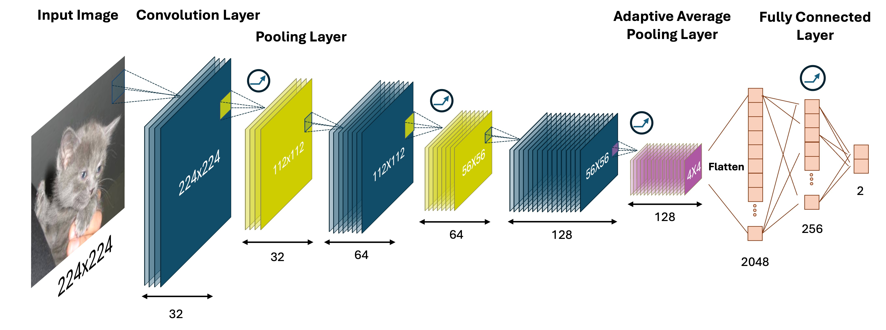
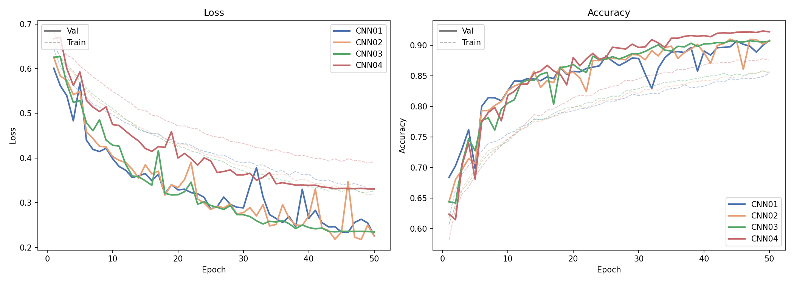
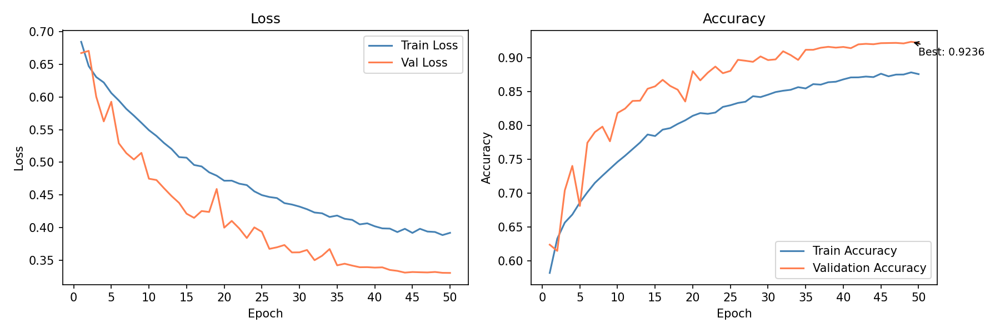
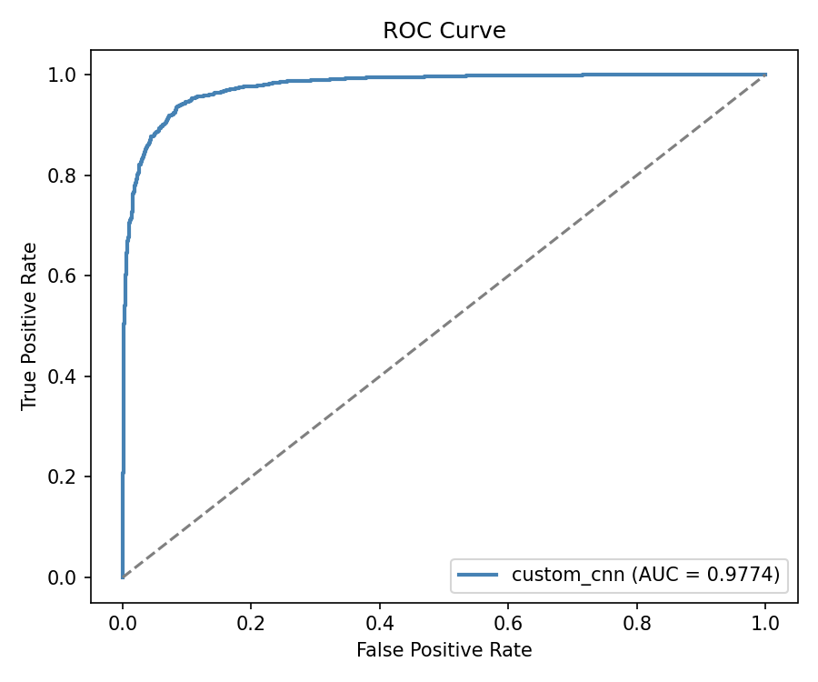
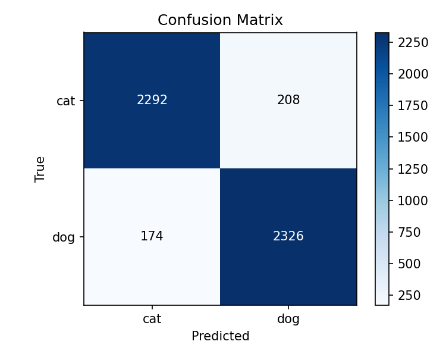
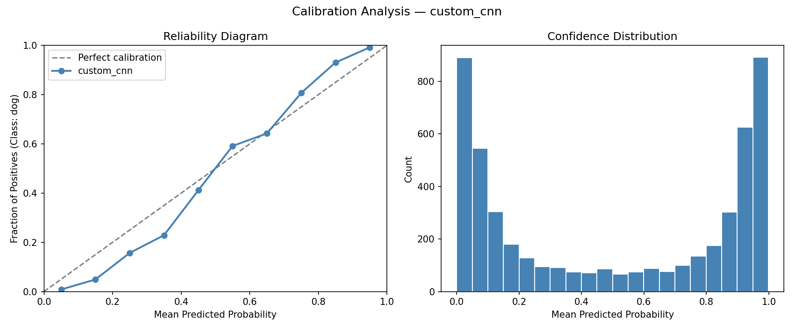

# Cat vs Dog Classifier

## Background
This repository implements a binary image classifier that distinguishes between cats and dogs using deep learning. The project explores two model architectures: a custom CNN trained from scratch and a pretrained ResNet-18 fine-tuned via transfer learning, including a full pipeline for training, evaluation, and result comparison.


## Install

#### 1. Create and activate a virtual environment
```bash
python -m venv venv
source venv/bin/activate        # macOS/Linux
venv\Scripts\activate           # Windows
```

#### 2. Install dependencies
```bash
pip install -r requirements.txt
```

#### 3. Prepare the dataset
Place the training images under `data/train/` following the `ImageFolder` format:
```
data/
└── train/
    ├── cat/
    │   ├── cat.0.jpg
    │   └── ...
    └── dog/
        ├── dog.0.jpg
        └── ...
```
Training dataset can be downloaded from: https://duke.box.com/s/ievtjw55j5ozmcouuv005qkwslrq7ezp

The dataset contains 20,000 images (10,000 cats, 10,000 dogs) — balanced classes, so no class weighting is required.
The dataset is automatically split into train and validation sets using a stratified random split (default 80/20, reproducible via seed in `config.yaml`).

## Models

#### CustomCNN
A lightweight CNN trained from scratch with 3 convolutional blocks followed by a fully connected classifier head.
```
Conv(3→32) → BN → ReLU → MaxPool
Conv(32→64) → BN → ReLU → MaxPool
Conv(64→128) → BN → ReLU → AdaptiveAvgPool(4×4)
Flatten → Linear(2048→256) → ReLU → Linear(256→2)
```


#### BaseResNet18
Pretrained ResNet-18 (ImageNet weights) with the final fully connected layer replaced for binary classification. The backbone is frozen by default so only the classifier head is trained.

#### Comparison

| Model | Pretrained | Total Parameters | Trainable Parameters | Input Size |
|---|---|---|---|---|
| CustomCNN | No | 618,754 | 618,754 | 224×224 |
| ResNet18 | Yes (ImageNet) | 11,177,538 | 1,026 | 224×224 |


## Usage

### Configuration
Before running, edit `config.yaml` to set hyperparameters and output directories:

```yaml
data:
  train_dir: ./data/train
  val_split: 0.2
  batch_size: 32
  seed: 42

training:
  epochs: 50
  learning_rate: 0.005
  dropout: 0
  scheduler: cosine       # cosine, plateau, or none

models:
  base_resnet18:
    freeze_backbone: true
    output_dir: ./experiments/resnet18/exp01_baseline
  custom_cnn:
    output_dir: ./experiments/custom_cnn/exp01_baseline
```

Set `output_dir` to a meaningful experiment name (e.g. `exp01_baseline`) so results from different runs do not overwrite each other.

### Training
```bash
python train.py --model custom_cnn        # train CustomCNN
python train.py --model base_resnet18     # train ResNet-18
python train.py --model all               # train both sequentially
python train.py --list-models             # list available models
```
Each run saves the following to the configured `output_dir`:

| File | Content |
|---|---|
| `best_model.pth` | Model weights with the highest validation accuracy |
| `last_model.pth` | Model weights after the final epoch |
| `history.json` | Train/val loss and accuracy per epoch |
| `history.png` | Training curves plot |

### Evaluation
```bash
python evaluate.py --model custom_cnn
python evaluate.py --model base_resnet18
python evaluate.py --model all
```
Each run saves the following to the model's `output_dir`:

| File | Content |
|---|---|
| `metrics.txt` | Accuracy, Precision, Recall, per-class report |
| `predictions.json` | Ground-truth labels, predictions, probabilities |
| `confusion_matrix.png` | Confusion matrix |
| `roc_curve.png` | ROC curve with AUC |
| `calibration.png` | Reliability diagram + confidence distribution |
| `calibration_data.json` | Raw calibration data |

### Result Comparison
After evaluating multiple experiments, use `compare.py` to generate comparison plots across all runs.

**Step 1 — Edit `compare.py` to point to your experiment directories:**
```python
# result directory
data_dir = [
    "experiments/custom_cnn/exp04_baseline_50epoch",
    "experiments/custom_cnn/exp07_lr005_cos_50",
    "experiments/resnet18/exp01_baseline",
]
# label shown on the plot
data_name = ["CNN-baseline", "CNN-best", "ResNet18"] 
# output directory
output_dir = "outputs/comparison"
```

**Step 2 — Run:**
```bash
python compare.py                            # generate all plots
python compare.py --plot roc training_curve  # selected plots only
```

Available `--plot` options: `all`, `metrics`, `training_curve`, `roc`, `reliability_diagram`

Outputs saved to `output_dir`:

| File | Content |
|---|---|
| `compare_training_curve.png` | Overlaid val/train loss and accuracy curves |
| `compare_roc.png` | ROC curves with AUC for all experiments |
| `compare_reliability_diagram.png` | Reliability diagram comparison |
| Console | Accuracy / Precision / Recall / AUC summary table |


## Experiment Results

All experiments use the same 80/20 stratified train/val split with `seed=42`.


#### Custom CNN

| Experiment | LR | Scheduler | Val Acc | AUC |
|---|---|---|---|---|
| CNN 01 | 0.001 | — | 0.9080 | 0.9692 |
| CNN 02 | 0.002 | — | 0.9102 | 0.9717 |
| CNN 03 | 0.002 | CosineAnnealing | 0.9076 | 0.9664 |
| CNN 04 | 0.005 | CosineAnnealing | 0.9236 | 0.9774 |




#### Best Custom CNN Result

| History | ROC | Confusion Matrix | Reliable Diagram |
|---|---|---|---|
|  |  |  | |


#### Model Comparison

| Experiment | Val Acc | Precision | Recall | AUC |
|---|---|---|---|---|
| Custom CNN (best) | 0.9236 | 0.9179| 0.9304 | 0.9774 |
| ResNet18 + CosineAnnealing | 0.9820 | 0.9847 | 0.9792 | 0.9984 |


## Project Structure
```
cat_dog_classifier/
├── src/
│   ├── dataset.py       # data loading, augmentation, train/val split
│   ├── model.py         # CustomCNN and BaseResNet18 definitions
│   ├── trainer.py       # training loop, evaluation loop, device selection
│   └── utils.py         # metrics, plots, prediction utilities
├── train.py             # model training
├── evaluate.py          # model evaluation
├── compare.py           # result comparison
├── config.yaml          # hyperparameter and path configuration
└── requirements.txt
```